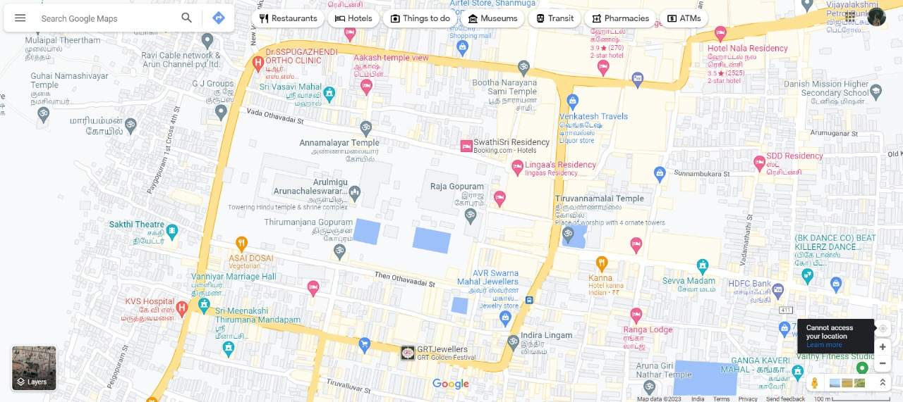
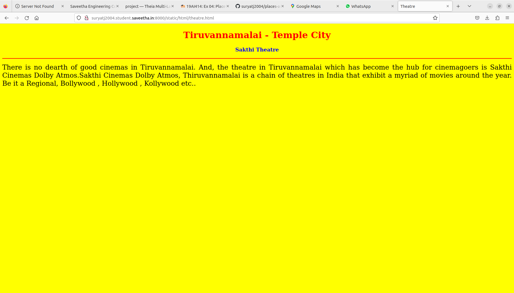
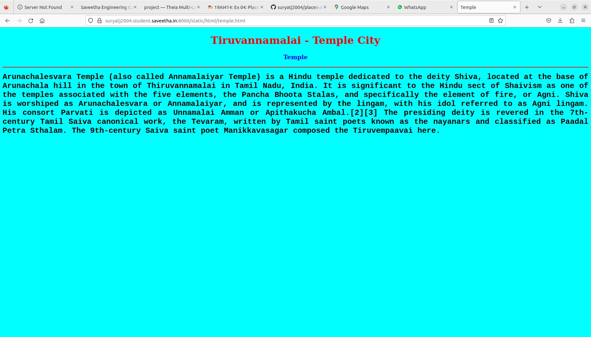
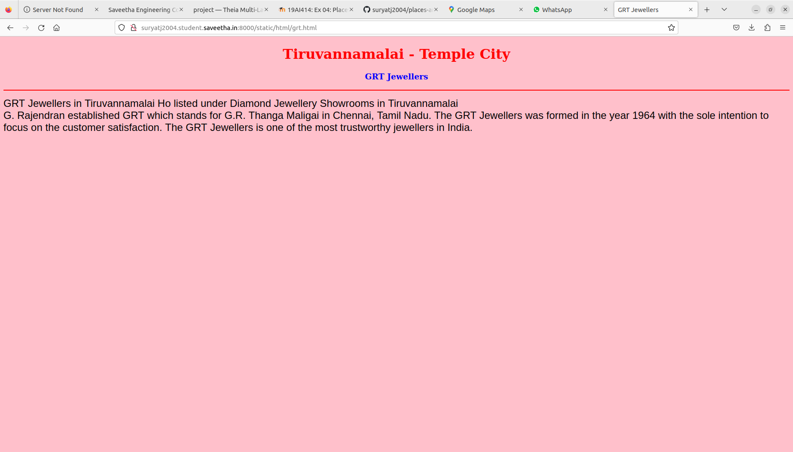
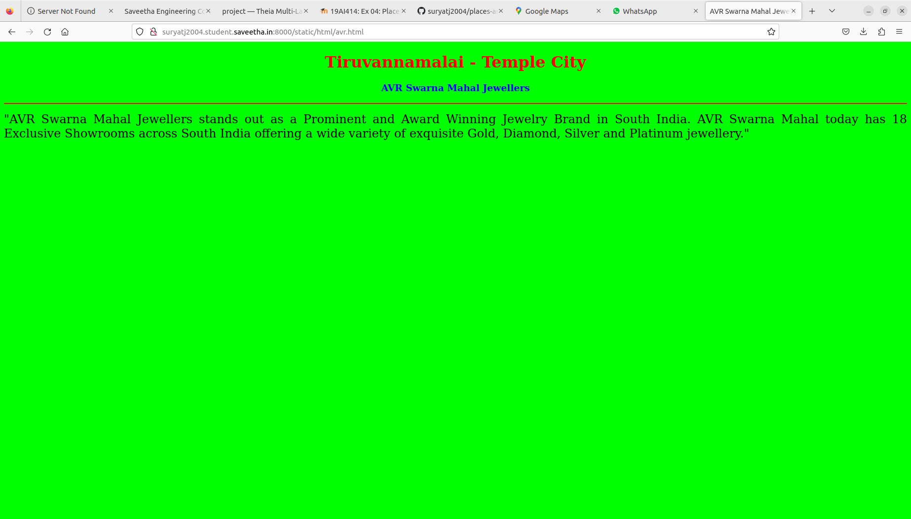
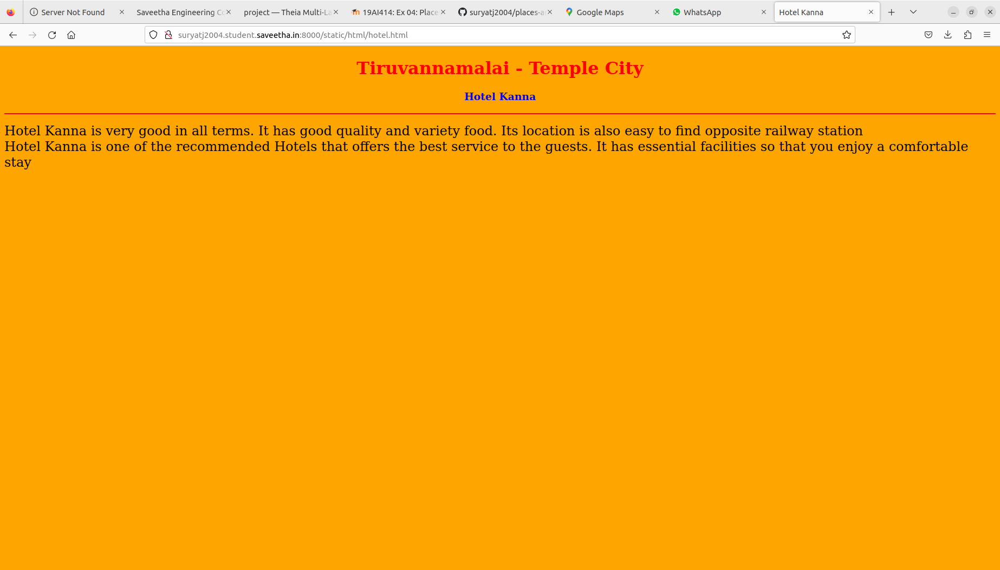
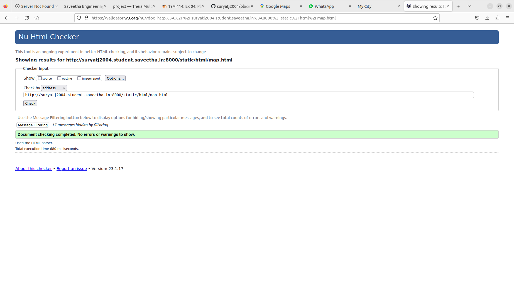

# Places Around Me
## AIM:
To develop a website to display details about the places around my house.

## Design Steps:

### Step 1:
Clone the github repository into Theia IDE.

### Step 2:
Create a new Django project

### Step 3:
Write the needed HTML code.

## Code:
```
map.html

<!DOCTYPE html>
<html lang="en">
<head>
<title>My City</title>
</head>
<body>
<h1 align="center">
<font color="red"><b>Tiruvannamalai - Temple City</b></font>
</h1>
<h3 align="center">
<font color="blue"><b>SURYA T  (22009136)</b></font>
</h3>
<center>

<map name="MyCity">
<area shape="rectangle" coords="372,228,458,263" href="/static/html/temple.html" title="Arunachaleswarar Temple">
<area shape="rectangle" coords="109,257,229,290" href="/static/html/theatre.html" title="Sakthi Theatre">
<area shape="rectangle" coords="455,390,617,508" href="/static/html/grt.html" title="GRT Jewellers">
<area shape="rectangle" coords="537,320,682,412" href="/static/html/avr.html" title="AVR Swarna Mahal Jewellers">
<area shape="rectangle" coords="664,312,870,412" href="/static/html/hotel.html" title="Hotel Kanna">
</map>
</center>
</body>
</html>

temple.html

<!DOCTYPE html>
<html lang="en">
<head>
<title>Temple</title>
</head>
<body bgcolor="cyan">
<h1 align="center">
<font color="red"><b>Tiruvannamalai - Temple City</b></font>
</h1>
<h3 align="center">
<font color="blue"><b>Temple</b></font>
</h3>
<hr size="3" color="red">
<p align="justify">
<font face="Courier New" size="5">
<b>
Arunachalesvara Temple (also called Annamalaiyar Temple) is a Hindu temple dedicated to the deity Shiva, located at the base of Arunachala hill in the town of Thiruvannamalai in Tamil Nadu, India. It is significant to the Hindu sect of Shaivism as one of the temples associated with the five elements, the Pancha Bhoota Stalas, and specifically the element of fire, or Agni.
Shiva is worshiped as Arunachalesvara or Annamalaiyar, and is represented by the lingam, with his idol referred to as Agni lingam. His consort Parvati is depicted as Unnamalai Amman or Apithakucha Ambal.[2][3] The presiding deity is revered in the 7th-century Tamil Saiva canonical work, the Tevaram, written by Tamil saint poets known as the nayanars and classified as Paadal Petra Sthalam. The 9th-century Saiva saint poet Manikkavasagar composed the Tiruvempaavai here.</b>
</font>
</p>
</body>
</html>

theatre.html

<!DOCTYPE html>
<html lang="en">
<head>
<title>Theatre</title>
</head>
<body bgcolor="yellow">
<h1 align="center">
<font color="red"><b>Tiruvannamalai - Temple City</b></font>
</h1>
<h3 align="center">
<font color="blue"><b>Sakthi Theatre </b></font>
</h3>
<hr size="3" color="red">
<p align="justify">
<font face="Tahoma" size="5">
There is no dearth of good cinemas in Tiruvannamalai. And, the theatre in Tiruvannamalai which has become the hub for cinemagoers is Sakthi Cinemas Dolby Atmos.Sakthi Cinemas Dolby Atmos, Thiruvannamalai is a chain of theatres in India that exhibit a myriad of movies around the year. Be it a Regional, Bollywood , Hollywood , Kollywood etc..</font>
</p>
</body>
</html>

grt.html

<!DOCTYPE html>
<html lang="en">
<head>
<title>GRT Jewellers</title>
</head>
<body bgcolor="pink">
<h1 align="center">
<font color="red"><b>Tiruvannamalai - Temple City</b></font>
</h1>
<h3 align="center">
<font color="blue"><b>GRT Jewellers</b></font>
</h3>
<hr size="3" color="red">
<p align="justify">
<font face="Arial" size="5">
<li>  GRT Jewellers in Tiruvannamalai Ho listed under Diamond Jewellery Showrooms in Tiruvannamalai</li>
<li> G. Rajendran established GRT which stands for G.R. Thanga Maligai in Chennai, Tamil Nadu. The GRT Jewellers was formed in the year 1964 with the sole intention to focus on the customer satisfaction. The GRT Jewellers is one of the most trustworthy jewellers in India.</li>
</b>
</font>
</p>
</body>
</html>

avr.html

<!DOCTYPE html>
<html lang="en">
<head>
<title>AVR Swarna Mahal Jewellers</title>
</head>
<body bgcolor="lime">
<h1 align="center">
<font color="red"><b>Tiruvannamalai - Temple City</b></font>
</h1>
<h3 align="center">
<font color="blue"><b>AVR Swarna Mahal Jewellers</b></font>
</h3>
<hr size="3" color="red">
<p align="justify">
<font face="Georgia" size="5">
"AVR Swarna Mahal Jewellers stands out as a Prominent and Award Winning Jewelry Brand in South India. AVR Swarna Mahal today has 18 Exclusive Showrooms across South India offering a wide variety of exquisite Gold, Diamond, Silver and Platinum jewellery."
</font>
</p>
</body>
</html>

hotel.html

<!DOCTYPE html>
<html lang="en">
<head>
<title>Hotel Kanna</title>
</head>
<body bgcolor="orange">
<h1 align="center">
<font color="red"><b>Tiruvannamalai - Temple City</b></font>
</h1>
<h3 align="center">
<font color="blue"><b>Hotel Kanna</b></font>
</h3>
<hr size="3" color="red">
<p align="justify">
<font face="Georgia" size="5">
<li>Hotel Kanna is very good in all terms. It has good quality and variety food. Its location is also easy to find opposite railway station</li>
<li>Hotel Kanna is one of the recommended Hotels that offers the best service to the guests. It has essential facilities so that you enjoy a comfortable stay</li></font>
</p>
</body>
</html>
```

## Output:












## HTML Validator:


## Result:
The program for implementing image map is executed successfully.